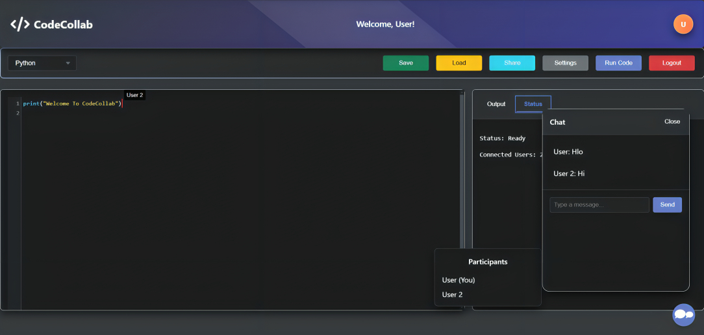

# 🌟 CodeCollab: Real-Time Collaborative Code Editor 🚀

[](https://github.com/VaibhavJain191/CodeCollab)
[](https://opensource.org/licenses/MIT)
[](#contributing)

### 🖥️ A powerful real-time collaborative code editor built for developers to code, execute, and collaborate effortlessly.

---

## 🌟 Project Overview

CodeCollab is a full-featured, real-time collaborative code editor. It supports multiple programming languages, code execution, version control, theming, and much more.

---

## 🖼️ Project Screenshot



---

## 🎯 Features

- **Real-Time Collaboration**: Work together with others, share cursors, and chat live.
- **Code Execution**: Run code in multiple programming languages.
- **Version Control**: Track changes, view edit history, and revert to previous versions.
- **Dark/Light Themes**: Switch between themes for better readability.
- **Responsive UI**: Works seamlessly across devices.
- **User Management**: Secure login and signup with JWT authentication.

---

## 🛠️ Tech Stack

| **Technology**     | **Purpose**                  |
|---------------------|------------------------------|
| `Node.js`          | Backend server               |
| `Express.js`       | Server routing framework     |
| `Socket.IO`        | Real-time collaboration      |
| `MongoDB Atlas`    | Database for user management |
| `CodeMirror`       | Syntax-highlighted code editor |
| `JWT`              | Secure user authentication   |
| `Bootstrap 5`      | Responsive UI                |

---

## 📖 How to Use

1. Clone this repository:
   ```bash
   git clone https://github.com/VaibhavJain191/CodeCollab.git
